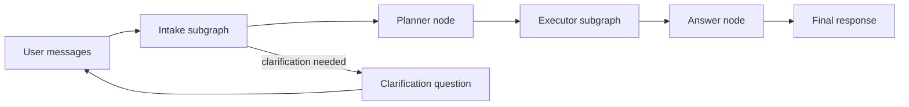

# Agentic RAG Architecture

This project implements an agentic RAG system using LangGraph. The system is decomposed into subgraphs with strict contracts between them to keep behavior testable, auditable, and adaptable to different retrieval backends.

## 🎯 Goals

- **Deterministic Orchestration**: Minimal "magic", predictable flow.
- **Clear Separation of Concerns**:
  - **Intake**: Understand the request and extract planning signals.
  - **Planner**: Produce an executable search plan.
  - **Executor**: Run retrieval, merge/rerank, select evidence, grade coverage.
  - **Answer**: Synthesize response using selected evidence and constraints.
- **Pluggable Adapters**: Support for hybrid retrieval, RRF fusion, cross-encoder reranking (CER), and HyDE.
- **Evaluation-First Design**: Schema contracts, behavior contracts, and stability tests.

---

## 🌊 High-Level Flow

---

## 🏛️ Subgraph Responsibilities

### 1. Intake Subgraph (`intent_graph`)
- **Inputs**: `messages`, optional `user_context_info`.
- **Outputs**: `normalized_query`, `constraints`, `guardrails`, `clarification` (blocking vs. non-blocking), and planning signals (intent labels, entities, acronyms).
- **Design Principle**: Intake must be stable, cheap, and must not retrieve or answer.
- **See**: [architecture_intent.md](./architecture_intent.md)

### 2. Planner Node
- **Inputs**: Intake outputs.
- **Outputs**: `PlannerState` (an executable plan).
  - **Strategy**: Direct answer vs. retrieve vs. clarify.
  - **Retrieval Rounds**: Query variants, modes, filters, use of HyDE, RRF, and reranking.
  - **Acceptance Criteria**: Stop conditions and budget knobs.
- **Design Principle**: Planner output is structured and auditable; the planner does not write the final answer.

### 3. Executor Subgraph
- **Inputs**: `PlannerState`, `normalized_query`, and extracted signals.
- **Outputs**: 
  - `final_evidence`: Selected chunks with provenance and scores.
  - `coverage`: What is answered and what is missing.
  - `retrieval_report`: Round-by-round telemetry for debugging.
  - `errors`: Structured list if any.
- **Design Principle**: Mostly deterministic; LLMs are used only for bounded tasks like HyDE or coverage grading.
- **See**: [architecture_executor.md](./architecture_executor.md)

### 4. Answer Node
- **Inputs**: `final_evidence`, `constraints`, and `answer_requirements`.
- **Outputs**: Final user response with citations and format constraints.
- **Design Principle**: Never expands beyond evidence. If coverage is missing blockers, ask for clarification instead of guessing.

---

## 📜 Contracts and Traceability

### State Contracts
- Every node reads from and writes to a typed state (`TypedDict` or Pydantic model).
- Nodes must only write fields they "own" to avoid race conditions.
- Errors are appended to a shared `errors` list rather than thrown as raw exceptions.

### Provenance Requirements
Every evidence chunk must preserve:
- **Identity**: `doc_id`, `chunk_id`.
- **Retrieval Trace**: `round_id`, `query`, `mode`.
- **Rank Features**: BM25/Vector rank, RRF score, and rerank score.
- **Metadata**: Source, title, section, and timestamps.

### Budget Controls (Hard Caps)
Enforced in the **executor gate** and per-round logic:
- `max_rounds`
- `max_candidates_per_round`
- `max_rerank_pool`
- `max_final_evidence_chunks`

---

## 🧪 Evaluation Architecture

### Test Categories
1. **Schema Contract (Hard Fail)**: Verifies output keys are present, types match, and required fields are non-empty.
2. **Behavior Contract (Hard Fail)**: Labeled expectations for a small set of fields to ensure intentional stability.
3. **Stability (Soft Fail)**: Reruns same cases multiple times to detect drift in key fields.

### Artifacts
Tests and tools write artifacts to disk for review, including inputs/outputs, expected labels, and per-round retrieval reports.

---

## 🔌 Extension Points

- **Retrieval Adapters**: Azure AI Search, Weaviate, pgvector, etc.
- **Reranker Models**: Cross-encoder choice (local, container, or cloud).
- **Policy Constraints**: Sensitivity and ACL filters.
- **Caching**: Optional layer for retrieval and rerank results.

---

## 🚧 Non-Goals (Currently)

- Full observability stack (Langfuse, OTEL).
- Multi-tenant governance and auditing.
- Advanced tool use beyond retrieval (browsing, SQL, etc.).
