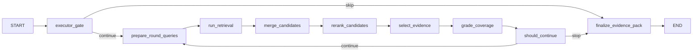

# Executor Subgraph Architecture

The executor subgraph consumes an executable `PlannerState` and performs retrieval and evidence selection. It is designed to be mostly deterministic and to support adapter-based integration with any retrieval stack.

## Purpose

- Execute the plan:
  - generate queries (optionally HyDE)
  - retrieve candidates via hybrid modes and filters
  - fuse results (RRF)
  - rerank (cross-encoder)
  - select diverse evidence within budgets
  - grade coverage and decide whether to continue
- Produce a compact evidence pack and a retrieval report for auditability

Executor must not:
- write the final user-facing answer
- invent content not present in evidence

## Inputs

Minimum inputs:
- `plan: PlannerState`
- `normalized_query`
- intake context:
  - `constraints`
  - `guardrails`
  - `signals`

Adapter inputs:
- retriever adapter (bm25/vector/hybrid)
- fusion adapter (RRF)
- reranker adapter (CER)
- HyDE adapter (optional)
- coverage grader adapter (optional)

## Outputs

- `final_evidence`: list of selected evidence candidates (chunks) with provenance
- `coverage`: structured coverage map
- `retrieval_report`: round-by-round trace
- `errors`: structured error list (if any)
- `continue_search`: used only internally for looping

## Subgraph overview

## Node responsibilities

### 1) executor_gate

validate plan strategy and required fields

enforce hard caps (max rounds, max docs)

initialize executor state fields and report

skip execution for non-retrieval strategies

Key outputs:

execution_context

current_round_index = 0

continue_search = true/false

### 2) prepare_round_queries

start from plan query_variants

apply literal constraints:

ensure must_preserve_terms appear verbatim in at least one query

if must_match_exactly, do not HyDE

optional HyDE:

synthesize short ideal answer

derive a few query variants

Key output:

round_queries

### 3) run_retrieval

for each query and retrieval mode:

call retriever.search(query, mode, k, alpha, filters)

annotate candidates with provenance:

round_id, query, mode

Key output:

round_candidates_raw

### 4) merge_candidates

dedupe by stable identity: doc_id + chunk_id

if enabled: apply RRF across ranked lists (by query and mode)

preserve rank features and provenance

Key output:

round_candidates_merged

### 5) rerank_candidates

if enabled: rerank top N candidates using cross-encoder

update rerank_score

keep metadata and provenance

Key output:

round_candidates_reranked

### 6) select_evidence

select up to max_docs with diversity constraints:

avoid too many chunks from the same doc

ensure coverage of different entities/subquestions if possible

enforce literal constraints when relevant:

try to include a chunk that contains must_preserve terms (when available)

Key output:

round_selected

### 7) grade_coverage

Bounded grading step:

inputs: acceptance criteria, selected evidence snippets

output: coverage map:

covered vs missing entities/subquestions

evidence quality

confidence score

contradictions list

This step should be structured and conservative:

mark covered only when explicitly supported by evidence

no user-facing prose

Key output:

coverage

### 8) should_continue

Deterministic stopping policy:

stop if reached max rounds

stop if confidence exceeds threshold (if set)

stop if no novelty for N consecutive rounds

otherwise continue

Also:

update evidence_pool with new selected chunks

append a RoundResult to rounds log

maintain no_new_streak in retrieval_report

Key outputs:

continue_search

current_round_index update (if continuing)

evidence_pool

rounds log

### 9) finalize_evidence_pack

sort pooled evidence by best available score

trim to max_total_docs

produce retrieval_report with round summaries

Key outputs:

final_evidence

retrieval_report

## Adapter model

The executor interacts with the outside world only through adapters:

RetrieverAdapter:

supports bm25, vector, hybrid

applies filters

returns candidates with metadata

FusionAdapter:

RRF is a safe deterministic default

RerankerAdapter:

cross-encoder rerank, top-k only

HyDEAdapter:

optional, disabled when literal constraints apply

CoverageGraderAdapter:

optional, can be a no-op initially

later replaced with a constrained LLM grader

This design allows you to swap backends without rewriting the graph.

## Budget and safety

Hard caps should be enforced before expensive steps:

retrieval modes and k values

rerank top-k

final evidence size

Safety signals can inform filters:

restrict doc types for sensitivity

apply ACL filters based on user_context_info

refuse retrieval for restricted data if guardrails require

## Evaluation targets

Executor evaluations are best split into two layers:

Plan execution correctness (unit-ish)

given a fixed PlannerState, verify:

correct adapter calls are made (mock adapters)

fusion and dedupe behave as expected

stop conditions are honored

End-to-end behavior (integration)

with real adapters + LLM grader:

confirm coverage improves across rounds

confirm HyDE is off when literal constraints exist

confirm reranker reduces irrelevant chunks

Artifacts should include:

per-round queries

candidate counts before and after fusion/rerank

selected evidence identifiers and scores

final evidence list used for answer node

