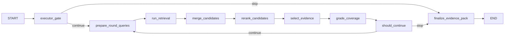

# Executor Subgraph Architecture

The executor subgraph consumes an executable `PlannerState` and performs retrieval and evidence selection. It is designed to be mostly deterministic and to support adapter-based integration with any retrieval stack.

## Purpose

- **Execute the plan:**
  - Generate queries (optionally HyDE).
  - Retrieve candidates via hybrid modes and filters.
  - Fuse results (RRF).
  - Rerank (cross-encoder).
  - Select diverse evidence within budgets.
  - Grade coverage and decide whether to continue.
- **Produce a compact evidence pack** and a retrieval report for auditability.

**Executor must not:**
- Write the final user-facing answer.
- Invent content not present in evidence.

---

## Inputs

### Minimum Inputs
- `plan`: `PlannerState`
- `normalized_query`: The original user query, normalized.
- **Intake Context:**
  - `constraints`: Literal requirements (e.g., "must include X").
  - `guardrails`: Safety and policy boundaries.
  - `signals`: Contextual hints.

### Adapter Inputs
- `retriever_adapter`: (BM25 / Vector / Hybrid)
- `fusion_adapter`: (RRF)
- `reranker_adapter`: (CER)
- `hyde_adapter`: (Optional)
- `coverage_grader_adapter`: (Optional)

---

## Outputs

- `final_evidence`: List of selected evidence candidates (chunks) with provenance.
- `coverage`: Structured coverage map.
- `retrieval_report`: Round-by-round execution trace.
- `errors`: Structured error list (if any).
- `continue_search`: Internal boolean used for looping.

---

## Subgraph Overview

---

## Node Responsibilities

### 1. `executor_gate`
- Validate plan strategy and required fields.
- Enforce hard caps (max rounds, max docs).
- Initialize executor state fields and reports.
- Skip execution for non-retrieval strategies.
- **Key outputs:** `execution_context`, `current_round_index = 0`, `continue_search = true/false`.

### 2. `prepare_round_queries`
- Start from plan `query_variants`.
- **Apply literal constraints:**
  - Ensure `must_preserve_terms` appear verbatim in at least one query.
  - If `must_match_exactly`, skip HyDE.
- **Optional HyDE:**
  - Synthesize a short ideal answer.
  - Derive query variants based on the hypothetical answer.
- **Key output:** `round_queries`.

### 3. `run_retrieval`
- For each query and retrieval mode:
  - Call `retriever.search(query, mode, k, alpha, filters)`.
- Annotate candidates with provenance: `round_id`, `query`, `mode`.
- **Key output:** `round_candidates_raw`.

### 4. `merge_candidates`
- Deduplicate by stable identity: `doc_id` + `chunk_id`.
- Apply **Reciprocal Rank Fusion (RRF)** across ranked lists (if enabled).
- Preserve rank features and provenance.
- **Key output:** `round_candidates_merged`.

### 5. `rerank_candidates`
- If enabled, rerank the top $N$ candidates using a **cross-encoder**.
- Update `rerank_score`.
- Maintain metadata and provenance.
- **Key output:** `round_candidates_reranked`.

### 6. `select_evidence`
- Select up to `max_docs` with diversity constraints:
  - Avoid too many chunks from the same document.
  - Ensure coverage of different entities/sub-questions.
- **Enforce literal constraints:**
  - Prioritize chunks containing `must_preserve` terms.
- **Key output:** `round_selected`.

### 7. `grade_coverage`
- **Bounded grading step:**
  - **Inputs:** Acceptance criteria, selected evidence snippets.
  - **Outputs:** `coverage` map (covered vs. missing entities, evidence quality, confidence score, contradictions).
- **Guidelines:**
  - Mark covered only when explicitly supported by evidence.
  - No user-facing prose generation.
- **Key output:** `coverage`.

### 8. `should_continue`
- **Deterministic stopping policy:**
  - Stop if max rounds reached.
  - Stop if confidence exceeds threshold.
  - Stop if no novelty for $N$ consecutive rounds.
- **State Management:**
  - Update `evidence_pool` with new selected chunks.
  - Append `RoundResult` to rounds log.
  - Maintain `no_new_streak` in `retrieval_report`.
- **Key outputs:** `continue_search`, `current_round_index` update, `evidence_pool`, `rounds_log`.

### 9. `finalize_evidence_pack`
- Sort pooled evidence by the best available score.
- Trim to `max_total_docs`.
- Produce a `retrieval_report` with round summaries.
- **Key outputs:** `final_evidence`, `retrieval_report`.

---

## Adapter Model

The executor interacts with the outside world only through adapters, ensuring the graph remains decoupled from specific retrieval implementations:

- **`RetrieverAdapter`**: Supports BM25, Vector, and Hybrid modes; applies filters; returns candidates with metadata.
- **`FusionAdapter`**: Handles candidate merging (RRF is the deterministic default).
- **`RerankerAdapter`**: Provides cross-encoder reranking for top-k candidates.
- **`HyDEAdapter`**: Optional; disabled when literal constraints apply.
- **`CoverageGraderAdapter`**: Optional; can be a no-op initially, later replaced with a constrained LLM grader.

---

## Budget and Safety

Hard caps are enforced before expensive steps:
- **Retrieval:** Limited $k$ values and modes.
- **Rerank:** Only rerank top-$k$.
- **Final Pack:** Trimmed to `max_total_docs`.

Safety signals inform filters:
- Restrict document types based on sensitivity.
- Apply ACL filters from `user_context_info`.
- Refuse retrieval for restricted data if guardrails require.

---

## Evaluation Targets

Executor evaluations are split into two layers:

### 1. Plan Execution Correctness (Unit-level)
Given a fixed `PlannerState`, verify:
- Correct adapter calls are made (using mocks).
- Fusion and deduplication behave as expected.
- Stopping conditions are honored.

### 2. End-to-End Behavior (Integration)
With real adapters and an LLM grader, confirm:
- Coverage improves across rounds.
- HyDE is disabled when literal constraints exist.
- Reranker effectively reduces irrelevant chunks.

**Artifacts for evaluation should include:**
- Per-round queries.
- Candidate counts before/after fusion and rerank.
- Selected evidence identifiers and scores.
- Final evidence list used for the answer node.

