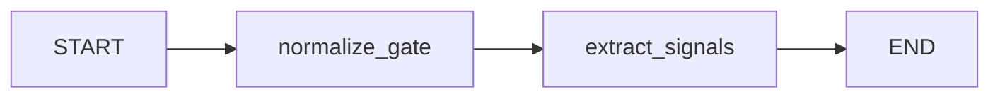

# Intent Intake Subgraph Architecture

The intent (intake) subgraph provides a stable "first look" at the user request. It extracts normalized inputs and planning signals while keeping this step separate from planning and retrieval.

## Purpose

- Standardize the request for logging and downstream planning
- Identify risk and sensitivity signals early
- Detect ambiguity and decide whether clarification is blocking
- Extract structured signals that improve later planning and retrieval

Intake must not:
- retrieve documents
- answer the user
- generate long reasoning text

## Inputs

Primary input:
- `messages`: chat history messages (LangChain message objects or role/content dicts)

Optional inputs:
- `user_context_info`: app-provided context (ACL, org metadata, role)
- `conversation_summary`: optional summary from upstream system

## Outputs

The intake subgraph writes to `IntakeState`:

1) Normalize + gate
- `normalized_query`: cleaned, minimal query for downstream use
- `constraints`: explicit format, prohibitions, domain hints, nonfunctional constraints
- `guardrails`: time sensitivity, context dependency, sensitivity, pii flag
- `clarification`: needed, reasons (and whether blocking if you chose to model that)

2) Signals for planning
- `user_intent`: explain, lookup, compare, decide, troubleshoot, summarize, extract, draft, plan, other
- `retrieval_intent`: none, definition, procedure, evidence, examples, verification, background, mixed
- `answerability`: internal_corpus, external, user_context, reasoning_only, mixed
- `complexity_flags`: multi_intent, multi_domain, requires_synthesis, requires_strict_precision, long_query
- `signals`: entities, acronyms, artifact flags, literal terms

3) Meta
- `intake_version`: version string
- `debug_notes`: short, non-CoT notes (avoid chain-of-thought)

## Node breakdown

The intake subgraph is intentionally small and decomposed:

## Node: normalize_gate

Responsibilities:

- validate presence and shape of messages
- produce NormalizeModel output:
- normalized_query
- constraints
- guardrails
- clarification
- language, locale (optional)

## Best practices:

structured output using function calling

keep it cheap and stable

do not overfit: only normalize and gate, do not plan

## Failure behavior:

write errors with node, type, retryable, details

avoid throwing exceptions

## Node: extract_signals

Responsibilities:

classify intent fields and complexity

extract signals: entities, acronyms, artifact flags, literal terms

use normalized fields from previous step for context

## Best practices:

strict schema (Pydantic extra="forbid")

use Literals for labels (avoid free-text drift)

prefer conservative defaults (empty lists)

## Design guidelines

Keep intake stable

Intake outputs are used everywhere. Any drift propagates.

Prefer short prompts and structured schemas.

If you need more nuance, add fields gradually and evaluate.

Separate "signal extraction" from planning

Intake extracts signals that help planning.

Planner decides actions and budgets.
This separation improves evaluation, because you can validate signal quality without conflating it with retrieval results.

Literal terms are critical
If the user message includes:

error messages, stacktraces, IDs

quoted phrases

file paths or URLs

then:

preserve them in signals.literal_terms

set requires_strict_precision in complexity_flags

Later planning/execution can use this to avoid HyDE and reduce semantic drift.

## Evaluation targets

### Minimum quality checks:

normalized_query non-empty

constraints.format includes "no_code" if user requested it

ambiguous acronym triggers clarification reason (when applicable)

artifact flags set for stacktraces/paths/URLs

user intent classification matches rubric for a small reviewed case set

## Known risks

Over-classifying everything as explain

fix with rubric examples in prompt

enforce Literal labels and add small behavior contract tests

Prompt variable leakage (template missing variables)

keep prompt inputs explicit and minimal

test with smoke tests in CI

